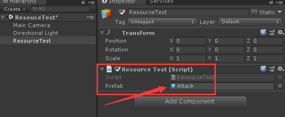

#  商业项目底层资源加载框架

##  二、资源加载

常用四种方式：

> * 组件拖拽式
> * Resource.Load()
> * AssetBundle.Load()
> * AssetDataBase.LoadAtPath()

---

###  方式1： 组件拖拽式 ：


>缺点：  
>资源混乱,项目过大,或者多人协同开发时不利于维护

  

```cs
//拖拽预置体，进行实例化
public GameObject m_prefab;
void Start () 
{
    Instantiate(m_prefab);
}
```  
`* 不建议使用该方式进行资源加载`  

---
### 方式2： Resource.Load()

>缺点：  
>1.需要把预置体放在Resources目录下  
>2.Resources 目录有存储上限 大概2G  
>3.无法进行热更等后期维护

```cs
void Start () 
{
    Instantiate(Resources.Load("Attack"));
}
```  

`* 商业项目不建议所有资源用这方式进行加载`

---
### 方式3： AssetBundle.Load()   

#### 1、写编辑器打包工具 并进行打出AB包

```cs
using System.Collections;
using System.Collections.Generic;
using UnityEngine;
using UnityEditor;

public class BundleEditor
{
    [MenuItem("Tools/打包")]
    public static void Build()
    {
        //打包AB包
        BuildPipeline.BuildAssetBundles
        (
            Application.streamingAssetsPath,//打包存储路径
            BuildAssetBundleOptions.ChunkBasedCompression,//常用压缩方式
            EditorUserBuildSettings.activeBuildTarget//打包平台(此处暂填编辑器使用的平台)
        );
        //刷新编辑器
        AssetDatabase.Refresh();
    }
}
```

#### 2、加载AB包，再加载资源

```cs
void Start () 
{
    //加载AB包
    AssetBundle bundle = AssetBundle.LoadFromFile(Application.streamingAssetsPath + "/attack");
    //通过AB包加载资源
    Instantiate(bundle.LoadAsset<GameObject>("attack"));
}
```

`* 该方式为商业项目常用资源加载这方式`

---

### 方式4： AssetDataBase.LoadAtPath()

```cs
void Start () 
{
    //参数：全路径
    GameObject go = UnityEditor.AssetDatabase.LoadAssetAtPath<GameObject>("Assets/GameData/Prefabs/Attack.prefab");
    Instantiate(go);
}
```


`* 该方式为编辑器资源加载方式，游戏运行是不会去使用的(编辑器类API)`