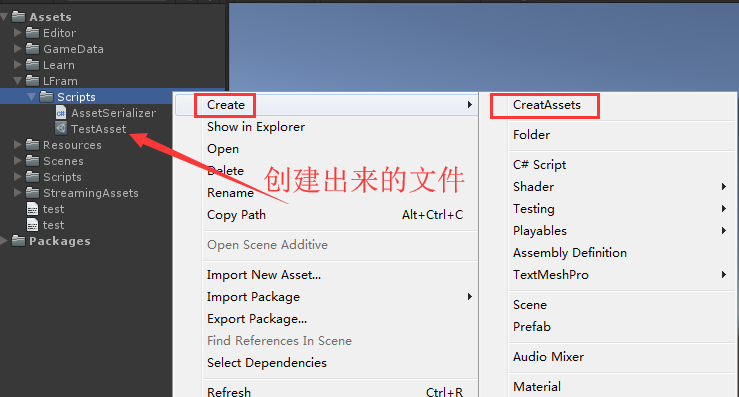
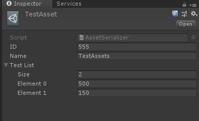

#  商业项目底层资源加载框架

##  三、序列化

### 1. 类与xml文件互转

> * Xml 序列化
```cs
using System.IO;
using System.Xml.Serialization;

void SerializeToXml(TestSerialize testSerialize)
{
    //创建流文件
    //参数1：创建到的位置
    //参数2：文件类型
    //参数3：文件权限
    //参数4：共享权限
    FileStream fileStream = new FileStream(Application.dataPath+"/test.xml",FileMode.Create,FileAccess.ReadWrite,FileShare.ReadWrite);
    //创建写入流
    StreamWriter writer = new StreamWriter(fileStream, System.Text.Encoding.UTF8);
    //xml序列化API
    XmlSerializer xml = new XmlSerializer(testSerialize.GetType());
    //参数1：写入流; 参数2：要序列化的类
    //xml.Serialize() 把类序列化到写入流里面
    xml.Serialize(writer, testSerialize);

    writer.Close();
    fileStream.Close();
}
```

> * Xml 反序列化

```cs
TestSerialize XmlDeSerialize()
{
    FileStream fileStream = new FileStream(Application.dataPath+"/test.xml",FileMode.Open,FileAccess.ReadWrite,FileShare.ReadWrite);
    XmlSerializer xml = new XmlSerializer(typeof(TestSerialize));
    TestSerialize testSerialize = (TestSerialize)xml.Deserialize(fileStream);

    fileStream.Close();
    return testSerialize;
}
```


### 2. 类与二进制文件互转

> * 二进制 序列化

```cs
using System.Runtime.Serialization.Formatters.Binary;

void BinarySerialize(TestSerialize testSerialize)
{
    FileStream fs = new FileStream(Application.dataPath+"/test.bytes",FileMode.Create,FileAccess.ReadWrite,FileShare.ReadWrite);
    //二进制流序列化
    BinaryFormatter bf = new BinaryFormatter();
    bf.Serialize(fs,testSerialize);

    fs.Close();
}
```

> * 二进制文件 反序列化

```cs

TestSerialize BinaryDeSerialize()
{
    TextAsset textAsset = UnityEditor.AssetDatabase.LoadAssetAtPath<TextAsset>("Assets/test.bytes");
    MemoryStream memoryStream = new MemoryStream(textAsset.bytes);
    BinaryFormatter bf = new BinaryFormatter();
    TestSerialize testSerialize = (TestSerialize)bf.Deserialize(memoryStream);
    return testSerialize;
}
```

### 3. Assets 序列化  

> 创建

```cs
//fileName => 创建出来的文件名称; menuName => 右键菜单上名称; order => 菜单上排序 0=最上
[CreateAssetMenu(fileName = "TestAsset",menuName = "CreatAssets", order = 0)]
public class AssetSerializer : ScriptableObject
{
	//继承ScriptableObject 才能Assets序列化
}
```
  
  

> 读取

```cs
void ReadTestAssets()
{
    AssetSerializer assets = UnityEditor.AssetDatabase.LoadAssetAtPath<AssetSerializer>("Assets/LFram/Scripts/TestAsset.asset");

    Debug.Log(assets.ID);
    Debug.Log(assets.Name);
    foreach (var item in assets.TestList)
    {
        Debug.Log(item);
    }
}
```

